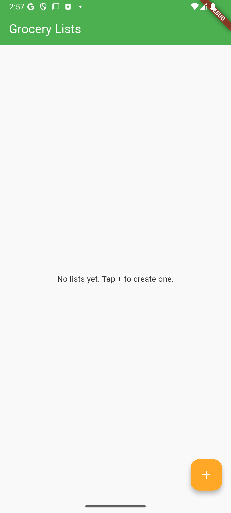
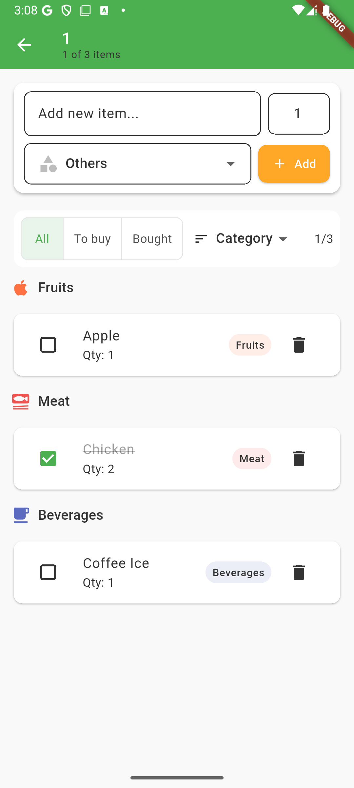
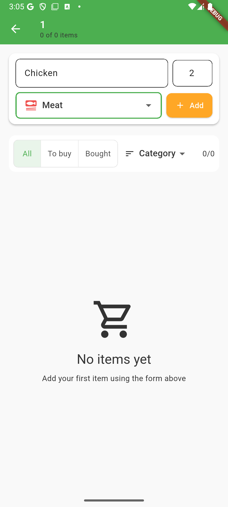
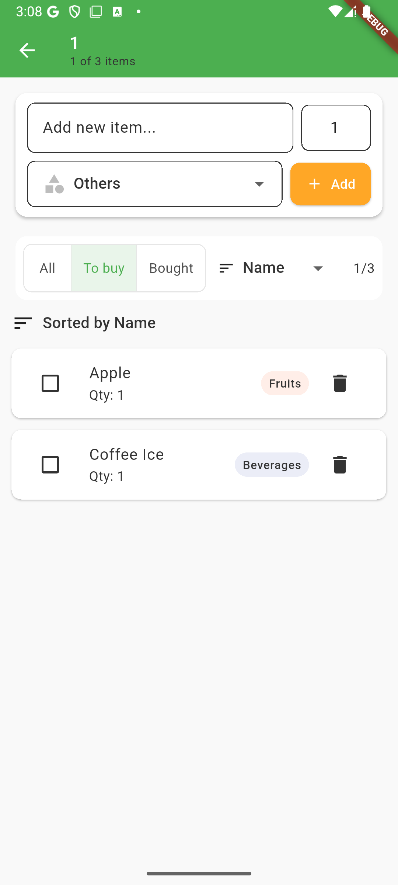

# 🛒 Grocery List App

A modern Flutter application for managing grocery shopping lists with intuitive design and real-time synchronization.

## ✨ Features

### Core Functionality

- **Multiple Lists**: Create and manage multiple grocery lists
- **Smart Categories**: Organize items by categories (Fruits, Vegetables, Dairy, Meat, etc.)
- **Item Management**: Add, edit, delete, and check off items
- **Quantity Tracking**: Specify quantities for each item
- **Visual Categories**: Color-coded icons for different item categories

### User Interface

- **Responsive Design**: Works seamlessly on mobile and web
- **Modern Material Design**: Clean, intuitive interface
- **Dark/Light Theme Support**: Adapts to system preferences
- **Smooth Animations**: Enhanced user experience with transitions

### Advanced Features

- **Smart Sorting**: Sort by category, name, or quantity
- **Filtering Options**: View all items, pending items, or completed items
- **Swipe to Delete**: Quick item removal with swipe gestures
- **Long Press to Edit**: Easy editing with long press interaction
- **Real-time Updates**: Changes sync across all instances

## 📱 Screenshots

| Home Screen                   | List Detail                   | Add Item                         | Categories                        |
| ----------------------------- | ----------------------------- | -------------------------------- | --------------------------------- |
|  |  |  |  |

## 🏗️ Architecture

### Technical Stack

- **Framework**: Flutter 3.x
- **State Management**: Provider pattern
- **Backend**: Firebase Firestore (with In-Memory fallback)
- **Storage**: Cloud Firestore for persistence
- **Platforms**: Android, iOS, Web

### Project Structure

```
lib/
├── models/           # Data models (GroceryItem, GroceryList, Category)
├── providers/        # State management (ListsProvider, ListDetailProvider)
├── repository/       # Data access layer
│   ├── firebase_grocery_repository.dart
│   ├── in_memory_grocery_repository.dart
│   └── repository_factory.dart
├── screens/          # UI screens (HomeScreen, ListDetailScreen)
├── widgets/          # Reusable components
├── utils/            # Utilities and helpers
└── theme.dart        # App theming
```

### Data Flow

1. **UI Layer** (Screens/Widgets) → **Provider** (State Management)
2. **Provider** → **Repository** (Data Access)
3. **Repository** → **Firebase/Memory** (Data Storage)

## 🚀 Getting Started

### Prerequisites

- Flutter SDK (3.0+)
- Dart SDK (3.0+)
- Android Studio / VS Code
- Firebase account (for cloud features)

### Installation

1. **Clone the repository**

   ```bash
   git clone <repository-url>
   cd grocery_list_app
   ```

2. **Install dependencies**

   ```bash
   flutter pub get
   ```

3. **Configure Firebase** (Optional - app works with in-memory storage)

   - Create a Firebase project at [Firebase Console](https://console.firebase.google.com)
   - Enable Firestore Database
   - Add your Firebase configuration files:
     - Android: `android/app/google-services.json`
     - iOS: `ios/Runner/GoogleService-Info.plist`
     - Web: Update `web/index.html` with Firebase config

4. **Run the application**

   ```bash
   # Android
   flutter run

   # Web
   flutter run -d chrome

   # iOS (macOS only)
   flutter run -d ios
   ```

## 🔄 Switching Between Storage Options

The app supports two storage backends:

### Firebase (Default - Cloud Storage)

- Real-time synchronization
- Persistent across devices
- Requires internet connection

### In-Memory (Local Storage)

- Works offline
- Data resets on app restart
- No setup required

To switch storage mode, modify `lib/utils/app_config.dart`:

```dart
// For Firebase
static bool get useFirebase => true;

// For In-Memory
static bool get useFirebase => false;
```

## 📦 Building for Production

### Android APK

```bash
flutter build apk --release
# Output: build/app/outputs/flutter-apk/app-release.apk
```

### Web Build

```bash
flutter build web --release
# Output: build/web/
```

### iOS (macOS only)

```bash
flutter build ios --release
```

## 🧪 Testing

```bash
# Run all tests
flutter test

# Run with coverage
flutter test --coverage
```

## 📝 Usage Guide

### Creating Your First List

1. Tap the **+** button on the home screen
2. Enter a name for your grocery list
3. Tap **Create**

### Adding Items

1. Open a grocery list
2. Type the item name in the input field
3. Set the quantity (default: 1)
4. Select a category from the dropdown
5. Tap **Add**

### Managing Items

- **Check off items**: Tap the checkbox when shopping
- **Edit items**: Long press on any item
- **Delete items**: Swipe left or tap the delete button
- **Sort items**: Use the sort dropdown (Category/Name/Quantity)
- **Filter items**: Toggle between All/To Buy/Bought

### Categories Available

- 🍎 Fruits
- 🥬 Vegetables
- 🥛 Dairy
- 🥩 Meat & Fish
- 🍞 Bakery
- 🥫 Canned Goods
- 🧴 Health & Beauty
- 🧽 Household
- 🍪 Snacks
- 🥤 Beverages
- ❄️ Frozen
- 📦 Others

## 🤝 Contributing

1. Fork the repository
2. Create a feature branch
3. Make your changes
4. Add tests if applicable
5. Submit a pull request

## 📄 License

This project is licensed under the MIT License - see the LICENSE file for details.

## 🔧 Development Notes

### Known Issues

- None currently reported

### Future Enhancements

- [ ] Shopping list sharing between users
- [ ] Barcode scanning for quick item addition
- [ ] Price tracking and budget management
- [ ] Recipe integration
- [ ] Voice input for hands-free adding
- [ ] Offline synchronization improvements

### Performance Optimizations

- Lazy loading for large lists
- Efficient state management with Provider
- Optimized rebuilds with proper widget keys
- Memory-efficient image handling

---

**Happy Shopping! 🛍️**
